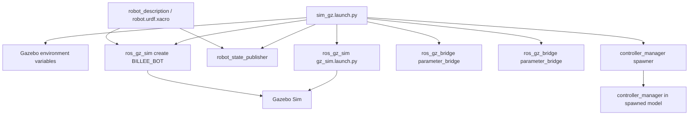
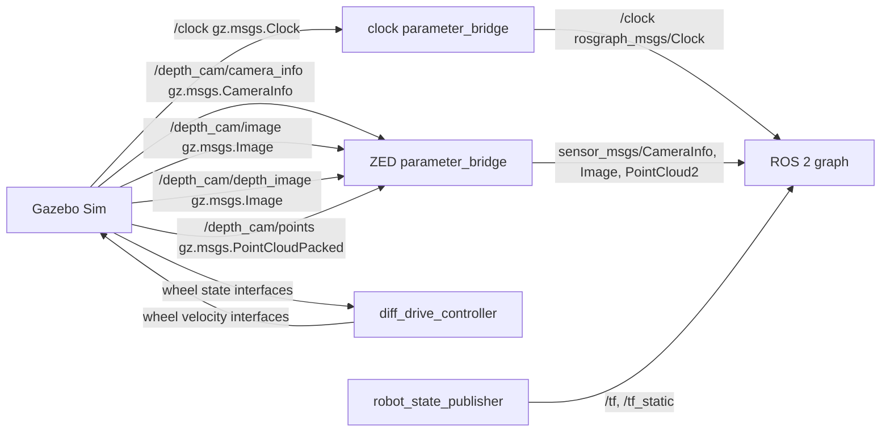

# chassis_bringup / `sim_gz.launch.py`

## 1. How This Node Works

`chassis_bringup` is the simulator bring-up package for the BILLEE chassis. Its only active launch file, `launch/sim_gz.launch.py`, expands `robot_description/urdf/robot.urdf.xacro`, starts Gazebo through `ros_gz_sim`, starts a robot-state publisher and two Gazebo-to-ROS bridges, spawns the rover as `BILLEE_BOT`, and asks the controller manager to activate the differential-drive and joint-state controllers.

The launch is designed for simulation time. It provides the expanded XML to `robot_state_publisher` as its `robot_description` parameter and passes the same description to `ros_gz_sim create` to insert the rover into Gazebo. The model itself loads `ign_ros2_control`, which reads the controller configuration supplied by `robot_description`.

The bridges are deliberately data-driven: `config/config.yaml` currently bridges only `/clock`; `config/zed_config.yaml` bridges four Gazebo camera streams from `/depth_cam` into ROS 2. The launch also ships joystick and teleoperation parameters in `config/joystick.yaml`, but it does not start `joy_node` or `teleop_node`; those settings are used by the separate `teleop` package in this workspace.

Viewer configs live alongside: `rviz/drivetrain.rviz` for RViz2 and `foxglove/drivetrain.json` for Foxglove Studio (import via Layouts → Import from file). Both show the same content — grid, TF, robot model from `/robot_description`, and the `/diff_drive_controller/odom` trail, fixed frame `odom` — and are loaded by `launch/viz.launch.py` (`rviz:=` / `foxglove:=`).

## 2. Technologies Behind It

- **ROS distro:** ROS 2 Humble.
- **Language(s) / core libraries:** Python ROS 2 Launch (`launch`, `launch_ros`, `ament_index_python`), Xacro command substitution, and ROS parameters.
- **External dependencies:** `ros_gz_sim`, `ros_gz_bridge`, `robot_state_publisher`, `controller_manager`, `ros2_controllers`, `ign_ros2_control` / `gz_ros2_control`, and Gazebo / Ignition Gazebo 6.
- **Build system / target platform(s):** `ament_cmake`, installed with `colcon`; the workspace uses Pixi for the Humble/Gazebo dependency set.
- **Middleware / networking notes:** `ros_gz_bridge` converts between Gazebo Transport and ROS 2. The configured bridge directions are all Gazebo-to-ROS; no DDS vendor or remote bridge is set here.

## 3. How It Was Written

The launch uses an `OpaqueFunction` because it must evaluate launch substitutions before constructing the string passed as Gazebo arguments and before expanding the lander Xacro. It resolves package-share and package-prefix paths through the ament index instead of assuming an installed location for the robot description and control plugin.

Gazebo resource, model, system-plugin, GUI-plugin, and QML import environment variables are set before Gazebo starts. This is important because the BILLEE model resolves meshes with `package://robot_description/...` and its simulator control plugin is provided by the activated Pixi/ROS environment rather than by this package.

The launch separates model state, simulator creation, and transport bridging into independent processes. That makes the Xacro model authoritative for both ROS transforms and Gazebo physics, while YAML files hold topic mapping choices. The controller spawner requests `diff_drive_controller` and `joint_state_broadcaster` together, relying on the plugin embedded in the spawned robot model to create the controller manager.

There are no package-specific unit or launch tests. Validate with a full simulator launch and ROS CLI checks. Two current implementation details are worth preserving: `world_file` is declared but ignored because `gz_args` is hard-coded to `empty.sdf`, and `config/config.yaml` does not yet bridge velocity-command or odometry topics despite the launch-file TODO noting both gaps.

## 4. Architecture

### 4a. Launch composition



### 4b. Topic / interface graph



The active configuration has no `/cmd_vel` or `/odom` Gazebo-to-ROS bridge edge.

## 5. How to Run It

### Prerequisites

- Start in `ros2_ws` with the Pixi environment installed; it provides ROS 2 Humble, Gazebo, ROS-Gazebo integration, and ROS 2 control.
- Use a graphical environment capable of running Gazebo. The launch contains GUI/QML paths for the project’s default devcontainer/Pixi layout.
- Build both `robot_description` and `chassis_bringup`; the latter cannot run without the former.

### Build

```bash
cd ros2_ws
pixi run build
source install/setup.bash
```

### Launch

```bash
cd ros2_ws
source install/setup.bash
ros2 launch chassis_bringup sim_gz.launch.py
```

Supported launch arguments are:

```bash
ros2 launch chassis_bringup sim_gz.launch.py \
  description_pkg:=robot_description \
  xacro_file:=urdf/robot.urdf.xacro \
  x:=0.0 y:=0.0 z:=0.2 yaw:=0.0
```

`world_file` is accepted as an argument but does not currently change the launched world; the launch passes `empty.sdf` to Gazebo unconditionally.

### Verify it's running

- Gazebo should contain an entity named `BILLEE_BOT`.
- `ros2 topic echo --once /clock` should return a `rosgraph_msgs/msg/Clock` message.
- `ros2 topic echo --once /depth_cam/camera_info` should return a `sensor_msgs/msg/CameraInfo` message when the camera is rendering.
- `ros2 node list` should include `/robot_state_publisher` and two `parameter_bridge` processes (their exact names depend on ROS node-name resolution).
- `ros2 control list_controllers` should report the requested `diff_drive_controller` and `joint_state_broadcaster` once the control plugin is initialized.

### Common issues

- **Missing meshes, rendering resources, or `ign_ros2_control` plugin:** ensure the Pixi environment is active and run the provided launch rather than `gz sim` directly; the launch sets the required resource/plugin paths.
- **Gazebo GUI/QML load failure outside the devcontainer:** the launch hard-codes its GUI and QML plugin paths under `/workspaces/URC-2027/ros2_ws/.pixi/...`; update those two values for a different workspace location or environment layout.
- **No motion from ROS velocity commands:** the active `config.yaml` only bridges `/clock`. Add and validate the required velocity bridge before expecting ROS commands to reach Gazebo.
- **No ROS odometry:** likewise, no odometry bridge is currently configured.
- **`world_file:=...` has no effect:** this is a known launch-file limitation; change the `gz_args` construction to use `world_path`.

## 6. Subnode Breakdown

### Gazebo Sim (`gz_sim.launch.py` include)

- **Package:** `ros_gz_sim`
- **Purpose:** Starts Gazebo in run mode with verbosity 4 and an empty world; owns the Gazebo Transport graph and the spawned rover.
- **Publishes:** Gazebo `/clock` and the Gazebo-side `/depth_cam/*` sensor topics consumed by the bridge configuration.
- **Subscribes:** Gazebo model/plugin interfaces; no ROS 2 topic interface is declared by this launch include.
- **Services / Actions:** Gazebo services are implementation-provided; none are declared by `chassis_bringup`.
- **Parameters:** `publish_rate: 400.0` is passed under the `gazebo` node from `config/gz_params.yaml`.
- **Depends on:** Gazebo assets and plugins found through the launch-set environment variables.

### `robot_state_publisher`

- **Package:** `robot_state_publisher`
- **Purpose:** Publishes the BILLEE kinematic transform tree from the Xacro-expanded `robot_description`.
- **Publishes:**

  | Topic | Type | Description |
  |---|---|---|
  | `/tf` | `tf2_msgs/msg/TFMessage` | Dynamic transforms when joint states are available. |
  | `/tf_static` | `tf2_msgs/msg/TFMessage` | Fixed chassis, suspension, and camera transforms. |

- **Subscribes:** `/joint_states` (`sensor_msgs/msg/JointState`) when the joint-state broadcaster is active.
- **Services / Actions:** Parameter services supplied by ROS 2; no custom service/action is declared.
- **Parameters:**

  | Name | Default / launch value | Description |
  |---|---|---|
  | `robot_description` | Xacro expansion of `robot.urdf.xacro` | Rover model XML. |
  | `use_sim_time` | `true` | Uses the bridged simulation clock. |

- **Depends on:** `robot_description` assets; `/joint_states` for moving wheel transforms.

### Clock bridge (`parameter_bridge`)

- **Package:** `ros_gz_bridge`
- **Purpose:** Converts Gazebo simulation time into ROS 2 simulation time.
- **Publishes:**

  | Topic | Type | Description |
  |---|---|---|
  | `/clock` | `rosgraph_msgs/msg/Clock` | ROS 2 simulation clock converted from `gz.msgs.Clock`. |

- **Subscribes:** Gazebo `/clock` (`gz.msgs.Clock`).
- **Services / Actions:** None configured.
- **Parameters:** `config_file` points to `config/config.yaml`.
- **Depends on:** Gazebo Sim being active.

### ZED bridge (`parameter_bridge`)

- **Package:** `ros_gz_bridge`
- **Purpose:** Converts the robot model’s Gazebo RGB-D camera streams into ROS 2 messages.
- **Publishes:**

  | Topic | Type | Description |
  |---|---|---|
  | `/depth_cam/camera_info` | `sensor_msgs/msg/CameraInfo` | Camera calibration and metadata. |
  | `/depth_cam/image` | `sensor_msgs/msg/Image` | Simulated image stream. |
  | `/depth_cam/depth_image` | `sensor_msgs/msg/Image` | Simulated depth image. |
  | `/depth_cam/points` | `sensor_msgs/msg/PointCloud2` | Simulated point cloud. |

- **Subscribes:** The matching Gazebo topics (`gz.msgs.CameraInfo`, `gz.msgs.Image`, and `gz.msgs.PointCloudPacked`).
- **Services / Actions:** None configured.
- **Parameters:** `config_file` points to `config/zed_config.yaml`.
- **Depends on:** The `zed2i` Gazebo sensor embedded in `robot_description` and the Gazebo Sensors system plugin.

### Rover spawn client (`create`)

- **Package:** `ros_gz_sim`
- **Purpose:** Inserts the Xacro-expanded rover into Gazebo as entity `BILLEE_BOT`.
- **Publishes:** None.
- **Subscribes:** Reads the ROS parameter/topic source named `robot_description` through its `-topic robot_description` argument.
- **Services / Actions:** Calls the Gazebo entity-creation service internally; no custom ROS service/action is declared by this package.
- **Parameters:** None. Launch arguments provide entity name and pose: `x`, `y`, `z`, and `yaw`.
- **Depends on:** Gazebo Sim and a valid expanded robot description.

### Controller spawner (`spawner`)

- **Package:** `controller_manager`
- **Purpose:** Requests activation of `diff_drive_controller` and `joint_state_broadcaster`, which are declared in `robot_description/config/controllers.yaml` and instantiated by the model’s `ign_ros2_control` plugin.
- **Publishes:** None directly; activated controllers expose the motion and joint-state interfaces.
- **Subscribes:** None directly.
- **Services / Actions:** Calls controller-manager services to load/configure/activate the named controllers.
- **Parameters:** Controller names are positional launch arguments: `diff_drive_controller`, `joint_state_broadcaster`.
- **Depends on:** A spawned BILLEE model whose `ign_ros2_control` plugin has created a controller manager.

### Lander spawn client (defined but disabled)

- **Package:** `ros_gz_sim`
- **Purpose:** Would spawn `urdf/lander.urdf.xacro` as `Lander` using an inline XML string.
- **Publishes / Subscribes / Services / Actions:** Same create-client role as the rover spawn client; it is not added to the returned launch actions and therefore does not run.
- **Parameters:** Entity name `Lander`; XML comes from the lander Xacro.
- **Depends on:** It is currently disabled; uncomment `spawn_launcher` in the returned launch actions to use it.
