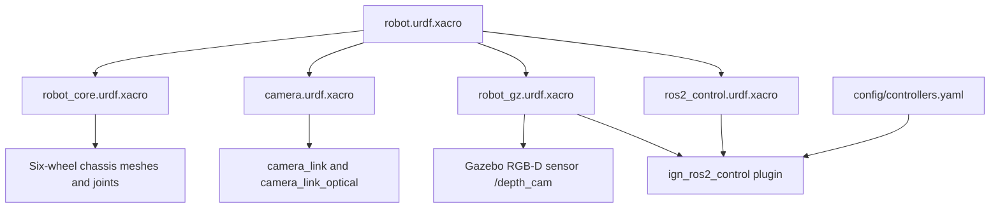
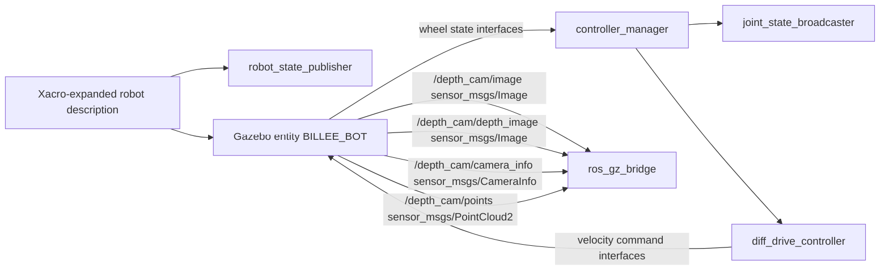

# robot_description

## 1. How This Node Works

`robot_description` is a ROS 2 description package, not a ROS node package. It supplies the BILLEE rover's Xacro/URDF model, visual and collision meshes, Gazebo sensor/control plugins, and the ROS 2 controller configuration that other packages consume. Its primary entry point is `urdf/robot.urdf.xacro`; expanding that file produces a six-wheel rover with a fixed ZED 2i camera frame.

The model starts with a mass-bearing `base_link` connected to a massless `base_footprint`, then defines two fixed suspension assemblies and six continuous wheel joints. `robot_gz.urdf.xacro` adds the simulation-specific pieces: an RGB-D camera sensor on `/depth_cam`, the Gazebo Sensors system, and the `ign_ros2_control` system plugin. `ros2_control.urdf.xacro` exposes velocity command and position/velocity state interfaces for all six wheels.

This package does not launch or publish anything by itself. `chassis_bringup` expands the primary Xacro, passes it to `robot_state_publisher`, and spawns the same XML into Gazebo. The Gazebo control plugin then loads `config/controllers.yaml`, where a differential-drive controller maps one linear/angular command into the six wheel velocities.

## 2. Technologies Behind It

- **ROS distro:** ROS 2 Humble (the workspace Pixi channels and dependencies are Humble).
- **Language(s) / core libraries:** XML/Xacro for the robot model; Python packaging through `setuptools`; standard ROS 2 description conventions and `robot_state_publisher` as the consumer.
- **External dependencies:** Xacro, Gazebo / Ignition Gazebo 6 compatibility stack, `ign_ros2_control` / `gz_ros2_control`, `controller_manager`, `diff_drive_controller`, and STL/OBJ mesh rendering.
- **Build system / target platform(s):** `ament_python`, built with `colcon`; the workspace’s default Pixi environment targets Linux with CUDA, with a CPU-only Linux-aarch64 environment for Apple-Silicon Docker development.
- **Middleware / networking notes:** No DDS or network settings are declared here. The model specifies simulation time through the consuming launch and exposes Gazebo camera data that `ros_gz_bridge` can bridge to ROS 2.

## 3. How It Was Written

The description is intentionally split by concern. `robot.urdf.xacro` is the composition point; `robot_core.urdf.xacro` owns the physical link, joint, inertia, collision, and mesh definitions; `camera.urdf.xacro` adds the fixed camera transform; and `robot_gz.urdf.xacro` contains Gazebo-only material, sensor, and plugin tags. This lets consumers choose the top-level model while keeping simulator-specific details out of the chassis geometry file.

The rover uses six independently modeled continuous wheel joints, but the controller treats them as two drive sides: `joint_wheel_l1`–`joint_wheel_l3` and `joint_wheel_r1`–`joint_wheel_r3`. `controllers.yaml` encodes the kinematic values currently used by simulation: 0.67 m wheel separation, 0.11 m wheel radius, a 30 Hz controller-manager update rate, and a 50 Hz controller publish rate. The `use_sim` Xacro property is hard-coded to `true` in `robot.urdf.xacro`, so the only implemented hardware backend is `ign_ros2_control/IgnitionSystem`; the non-simulation branch is explicitly a TODO.

The RGB-D camera model in `robot_gz.urdf.xacro` is configured at 1280×720 with a 120° horizontal field of view and a 10 Hz update rate. The camera intrinsics are calculated in `macros.xacro`. The package includes basic copyright, flake8, and PEP 257 test scaffolding, but no model-specific automated simulation or hardware-in-the-loop tests.

## 4. Architecture

### 4a. Description composition



### 4b. Runtime interface graph when used by `chassis_bringup`



## 5. How to Run It

### Prerequisites

- Run from `ros2_ws` with the workspace Pixi environment installed.
- Have the ROS 2 Humble, Gazebo, `ros_gz`, and `ign_ros2_control` dependencies supplied by `pixi.toml` available.
- For simulator use, use a host/container capable of rendering Gazebo; no physical-drive hardware plugin is implemented.

### Build

```bash
cd ros2_ws
pixi run build
source install/setup.bash
```

### Validate the model

```bash
cd ros2_ws
pixi run xacro src/robot_description/urdf/robot.urdf.xacro > /tmp/billee_robot.urdf
```

The command should finish without Xacro errors and produce a URDF containing the six `joint_wheel_*` joints and the `camera_link` frames.

### Launch

This package has no launch file. Launch it through the simulation bring-up:

```bash
cd ros2_ws
source install/setup.bash
ros2 launch chassis_bringup sim_gz.launch.py
```

### Verify it's running

- `ros2 param get /robot_state_publisher robot_description` should return the expanded model.
- `ros2 control list_controllers` should show `diff_drive_controller` and `joint_state_broadcaster` after the model has spawned and the control plugin has initialized.
- `ros2 topic echo --once /depth_cam/camera_info` should receive a camera calibration message when the Gazebo sensor is rendering.

### Common issues

- **Gazebo cannot find meshes or the control plugin:** launch through `chassis_bringup`; it sets the Gazebo resource and `ign_ros2_control` plugin paths.
- **Running on hardware:** there is no real hardware plugin in `ros2_control.urdf.xacro`; implement and select one before setting `use_sim` false.
- **No drive/odometry motion in ROS:** this package configures the controller, but the active bridge configuration does not bridge command or odometry topics. See `chassis_bringup/README.md`.

## 6. Subnode Breakdown

`robot_description` defines no executable ROS nodes and contains no launch files. The following are the runtime components and artifacts it configures when another package consumes `robot.urdf.xacro`.

### Robot description artifact

- **Package:** `robot_description`
- **Purpose:** Supplies the robot XML, frames, mesh URIs, Gazebo sensor tags, and `ros2_control` declaration.
- **Publishes:** None; a consumer such as `robot_state_publisher` publishes transforms from this artifact.
- **Subscribes:** None.
- **Services / Actions:** None.
- **Parameters:** None declared by this package.
- **Depends on:** Xacro, installed mesh assets, and a consumer such as `robot_state_publisher` or `ros_gz_sim create`.

### Gazebo RGB-D sensor (`zed2i`)

- **Package:** Gazebo model plugin configured by `robot_description`
- **Purpose:** Simulates the ZED 2i-style RGB-D camera attached to `camera_link`.
- **Publishes:**

  | Topic | Type | Description |
  |---|---|---|
  | `/depth_cam/camera_info` | `gz.msgs.CameraInfo` | Intrinsics and camera metadata; bridged to `sensor_msgs/msg/CameraInfo`. |
  | `/depth_cam/image` | `gz.msgs.Image` | Simulated monochrome/image stream; bridged to `sensor_msgs/msg/Image`. |
  | `/depth_cam/depth_image` | `gz.msgs.Image` | Simulated depth image; bridged to `sensor_msgs/msg/Image`. |
  | `/depth_cam/points` | `gz.msgs.PointCloudPacked` | Simulated depth point cloud; bridged to `sensor_msgs/msg/PointCloud2`. |

- **Subscribes:** None declared in the model.
- **Services / Actions:** None.
- **Parameters:**

  | Name | Default | Description |
  |---|---|---|
  | image width × height | `1280 × 720` | Render resolution. |
  | horizontal FOV | `120°` | Horizontal camera field of view. |
  | update rate | `10 Hz` | Sensor update frequency. |
  | depth range | `0.1–10 m` | Depth-camera clipping range. |

- **Depends on:** Gazebo Sensors system plugin and a rendering engine (`ogre2`).

### `ign_ros2_control` system and configured controllers

- **Package:** `ign_ros2_control` plus `controller_manager` / `ros2_controllers`
- **Purpose:** Exposes the six wheel joints to ROS 2 control and loads the differential-drive and joint-state broadcaster controllers from `config/controllers.yaml`.
- **Publishes:** Controller-specific ROS 2 state interfaces after the model is spawned; topic names are owned by the upstream controller plugins, not declared in this package.
- **Subscribes:** Wheel velocity command interfaces from `diff_drive_controller`; the configuration sets `use_stamped_vel: false`.
- **Services / Actions:** Controller-manager services are supplied by the upstream `controller_manager` node; this package declares none directly.
- **Parameters:**

  | Name | Default | Description |
  |---|---|---|
  | `controller_manager.update_rate` | `30` | Controller-manager update rate in Hz. |
  | `diff_drive_controller.left_wheel_names` | `joint_wheel_l1`, `joint_wheel_l2`, `joint_wheel_l3` | Left drive side. |
  | `diff_drive_controller.right_wheel_names` | `joint_wheel_r1`, `joint_wheel_r2`, `joint_wheel_r3` | Right drive side. |
  | `wheel_separation` | `0.67` | Track width in metres. |
  | `wheel_radius` | `0.11` | Wheel radius in metres. |
  | `cmd_vel_timeout` | `0.25` | Seconds before a stale drive command times out. |

- **Depends on:** A spawned Gazebo model, `libign_ros2_control-system.so`, and `controllers.yaml`.
